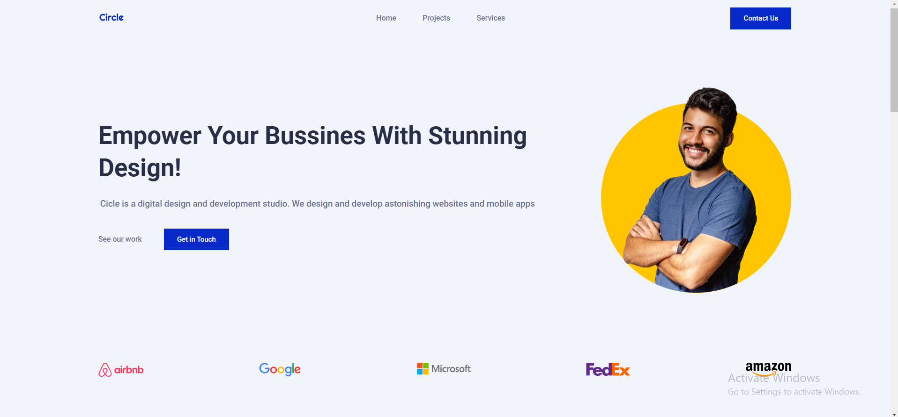
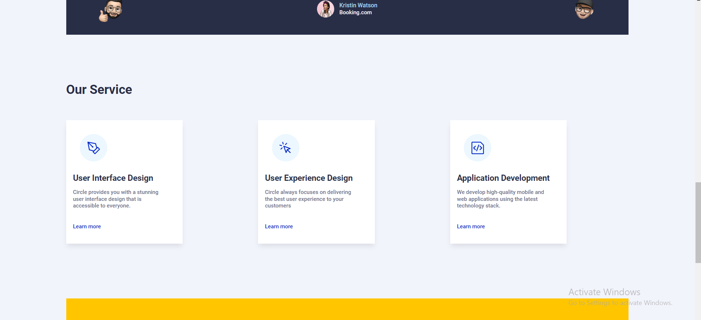
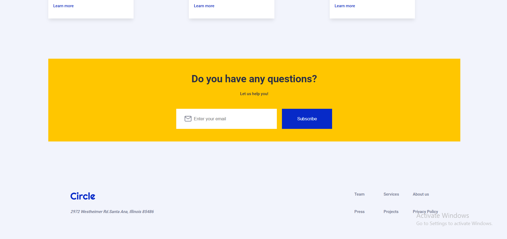
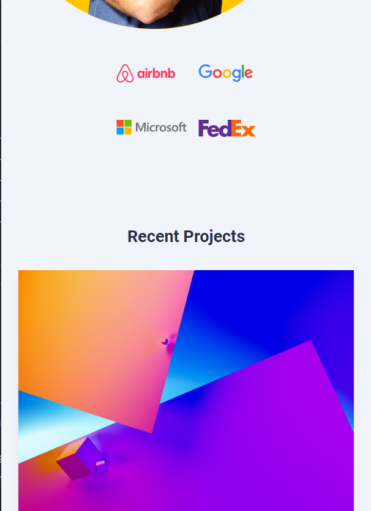
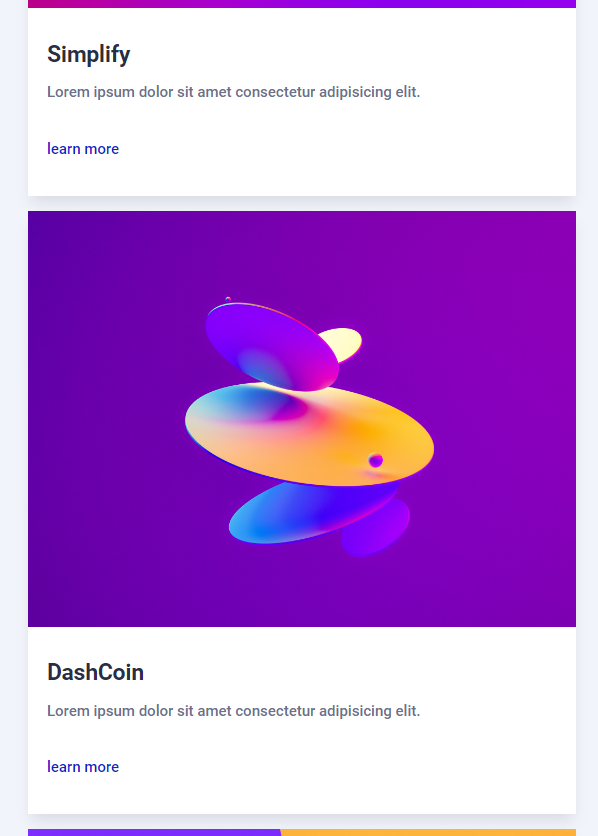
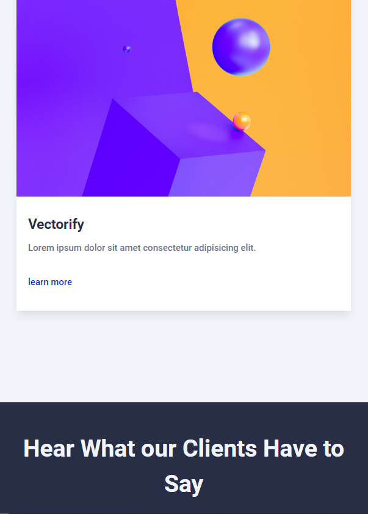
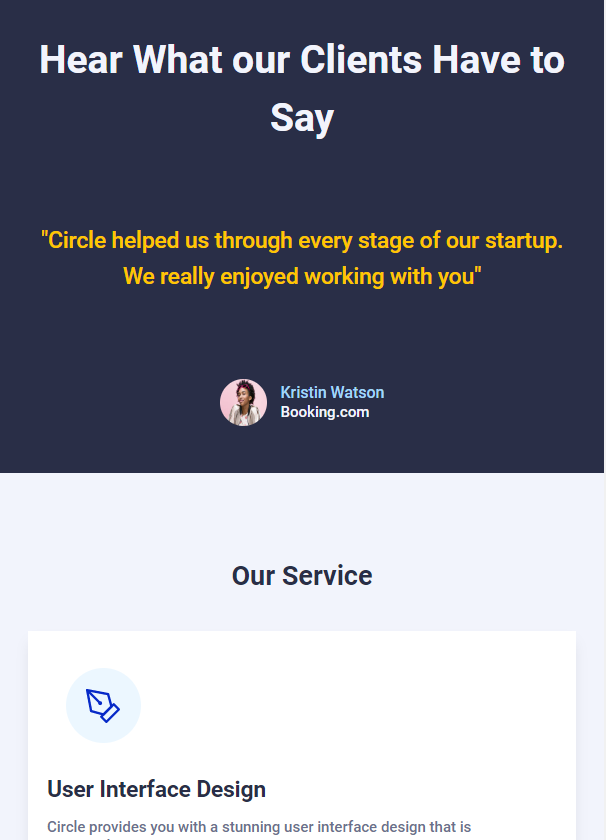
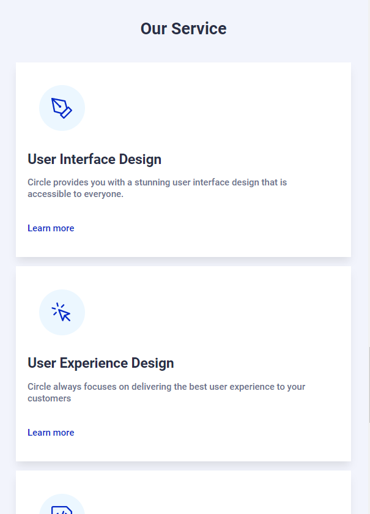

# WHAT DID I ACOMPLISH TODAY ?

---

## 19 - 09 - 2022

I first created the basic files & folders for the project, such as the Home.html & the style.css files.

I then started working on the Home page HTML layout, trying to clone it from the Figma design resource given to us. After a few minutes a little lost, I decided to take the following approach:

    1. Broke up the page into sections.
    2. Implemented the HTML per section.
        - while building the navbar, I realized I need to code a small script for the hamburguer menu while in mobile viewport. I then created a scripts folder and the hamburguer script file inside of it with the corresponding functionality.
    3. Checked against actual final product.
        a. If issue arose --> worked a solution ´till fixed.
        b. No issues --> next step.
    4. Implemented corresponding mobile responsive css for section.
    5. Finished with media queries for rest of viewports of each section, as I work each one of them.
    6. Checked responsiveness, if issue encountered, I worked a solution ´till I fixed the problem, if not, I started new section until reaching the footer.

Today, I was able to completed the Home page HTML and CSS for mobile responsiveness first and then the rest of the viewports.

What I found the ==most challenging== about today ==was== to code the ==media queries==, which I had a bit rusty, so it was a great way for me to practice them!.

What I have left to do in the Home page:

- [] Hero image placement on mobile viewport.
- [] Fix testimonials section width on desktop.

This is the final product on desktop viewport:

And here on mobile viewport:

