# :crossed_flags: WHAT DID I ACOMPLISH TODAY ?

---

:unlock: ## 19 - 09 - 2022
---
I first created the basic files & folders for the project, such as the Home.html & the style.css files.

I then started working on the Home page HTML layout, trying to clone it from the Figma design resource given to us. After a few minutes a little lost, I decided to take the following approach:

    1. Broke up the page into sections.
    2. Implemented the HTML per section.
        - while building the navbar, I realized I need to code a small script for the hamburguer menu while in mobile viewport. I then created a scripts folder and the hamburguer script file inside of it with the corresponding functionality.
    3. Checked against actual final product.
        a. If issue arose --> worked a solution ´till fixed.
        b. No issues --> next step.
    4. Implemented corresponding mobile responsive css for section.
    5. Finished with media queries for rest of viewports of each section, as I work each one of them.
    6. Checked responsiveness, if issue encountered, I worked a solution ´till I fixed the problem, if not, I started new section until reaching the footer.

Today, I was able to completed the Home page HTML and CSS for mobile responsiveness first and then the rest of the viewports.

What I found the **most challenging about today was to code the media queries**, which I had a bit rusty, so it was a great way for me to practice them!.

### :memo: What I have left to do in the Home page:

- ~~_Place two images inside Hero section (credit card + thumbs up)_~~
- ~~_Hero image placement on mobile viewport._~~
- ~~_Fix testimonials section width on desktop._~~

This is the final product on desktop viewport:

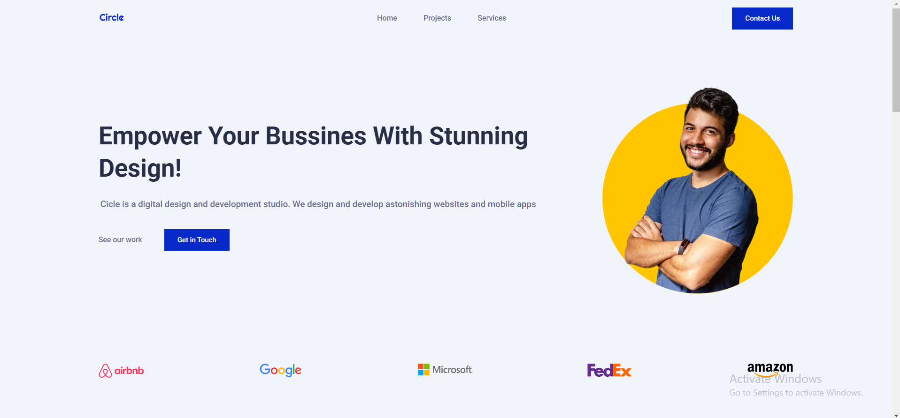
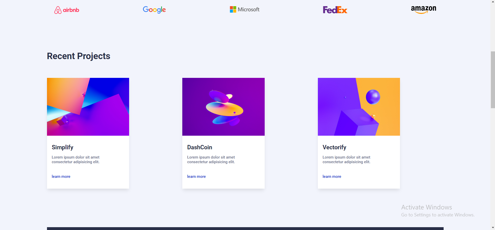
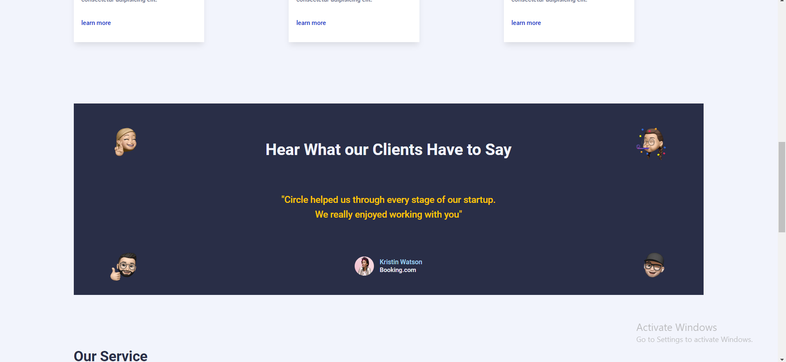
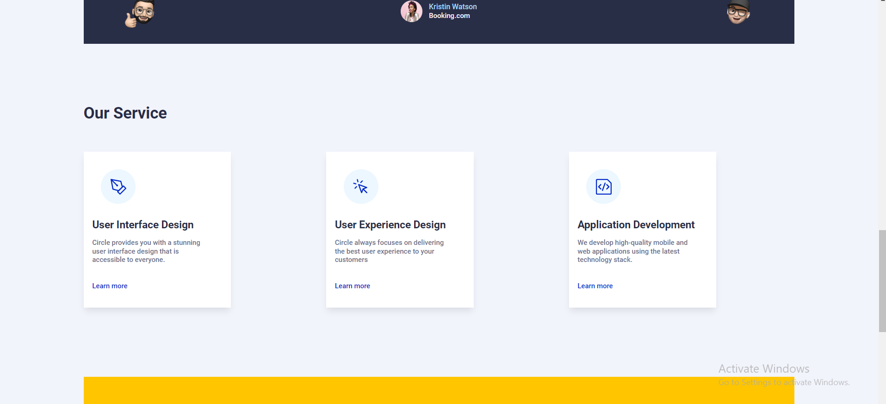
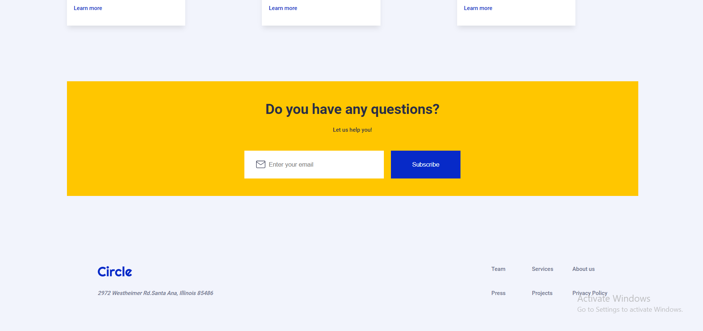

And here on mobile viewport:

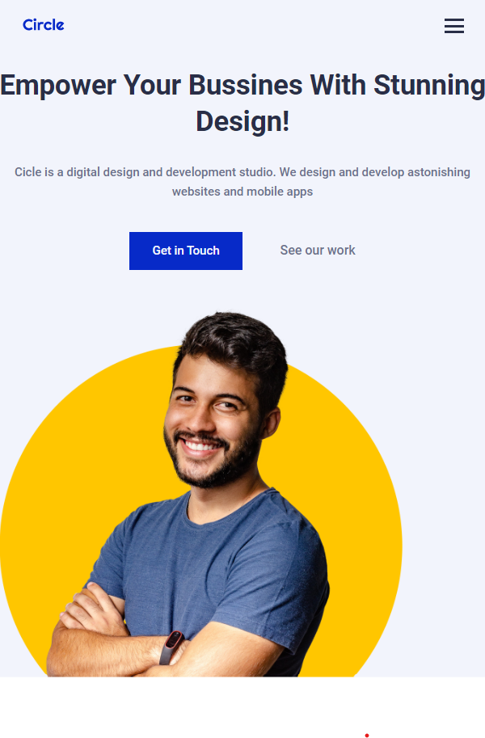
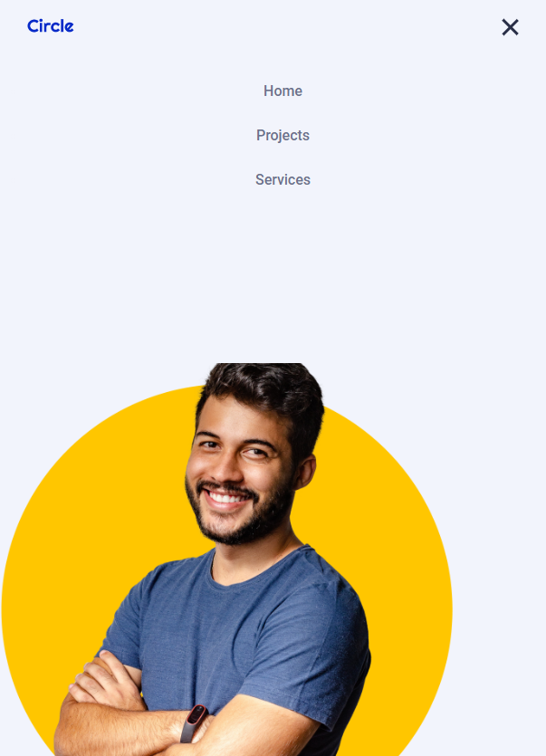
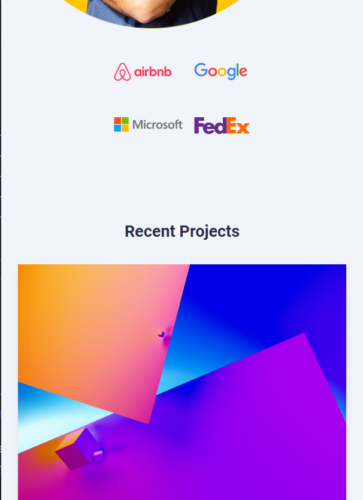
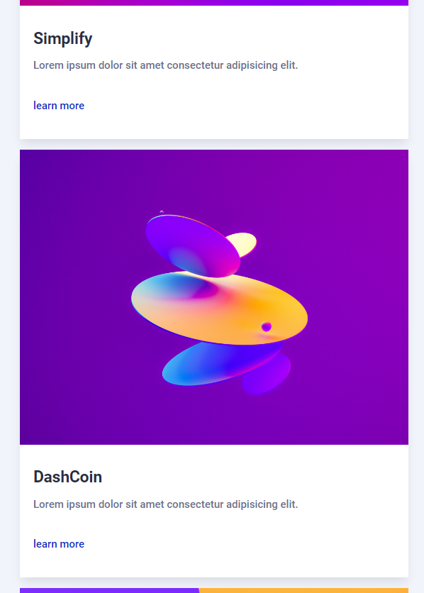
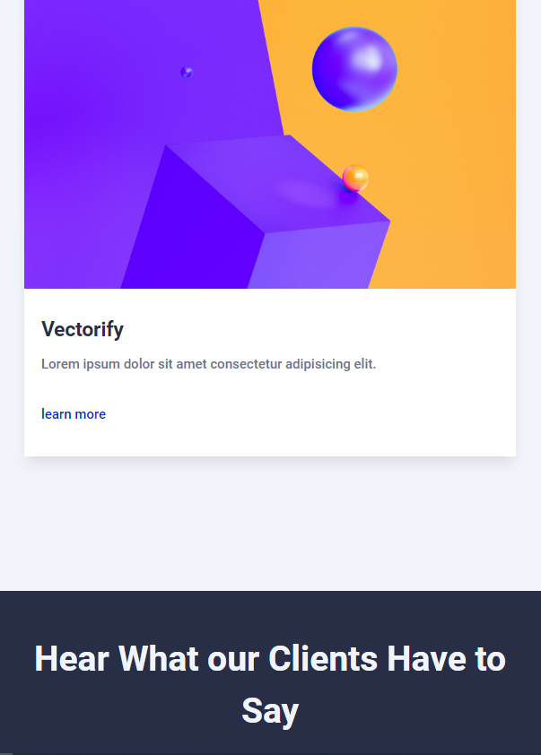
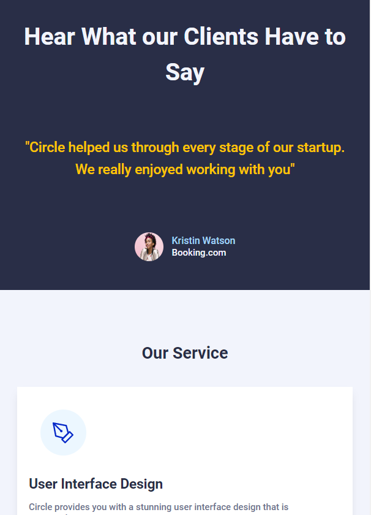
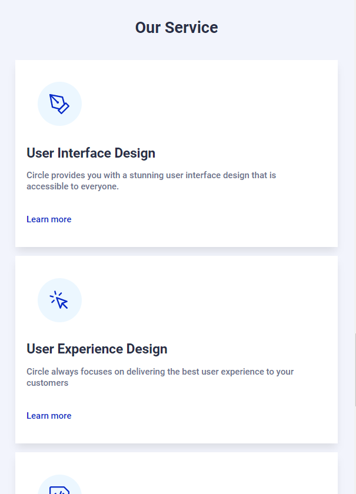
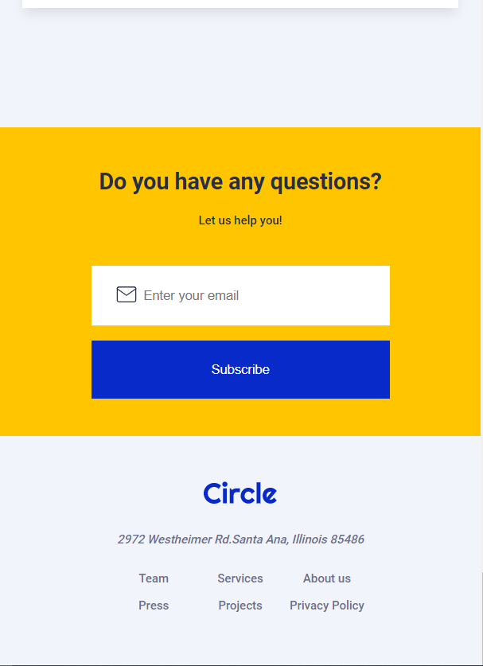

---

## :unlock: 20 - 09 - 2022
---
Today I was able to complete the rest of the HTML for the Projects page & the Contact page. I then worked on making them mobile responsive first and worked my way up to desktop viewport. My approach was the same than yesterday.

After finishing both HTML & CSS, I moved on to implement the fetch capabilities for the projects section of the Home page and I was able to achieve the desired results.

What I found **the most challenging about today was implementing the fetching capabilities** for the projects section of the Home page, nonetheless, I pulled it off.

---

## :unlock: 21 - 09 - 2022
---
On this day I added validations and posting capabilities to the form. I then fixed some small issues with the CSS & responsiveness. I also change the Home.html to index.html and restructure the folders as well.

What I found the **most challenging about today was how to set up the submission process for the form**. I finally decided to implement a validation condition that if passed it would trigger the rest of the logic and submit the form.

---
## :unlock: 22 - 09 - 2022
---
Today I deployed the site and it´s now live at [CircleAgency](https://mycircle-agency.netlify.app/)

